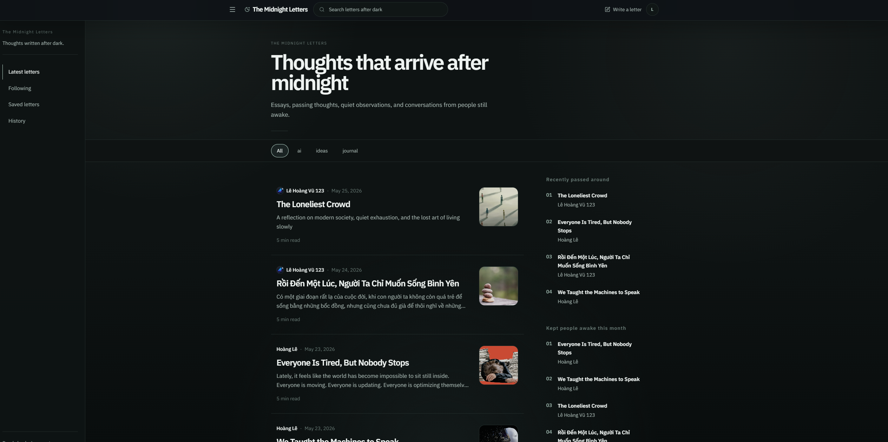
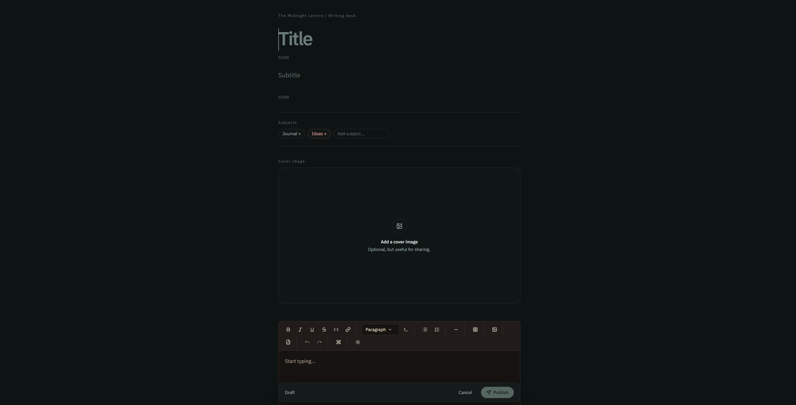
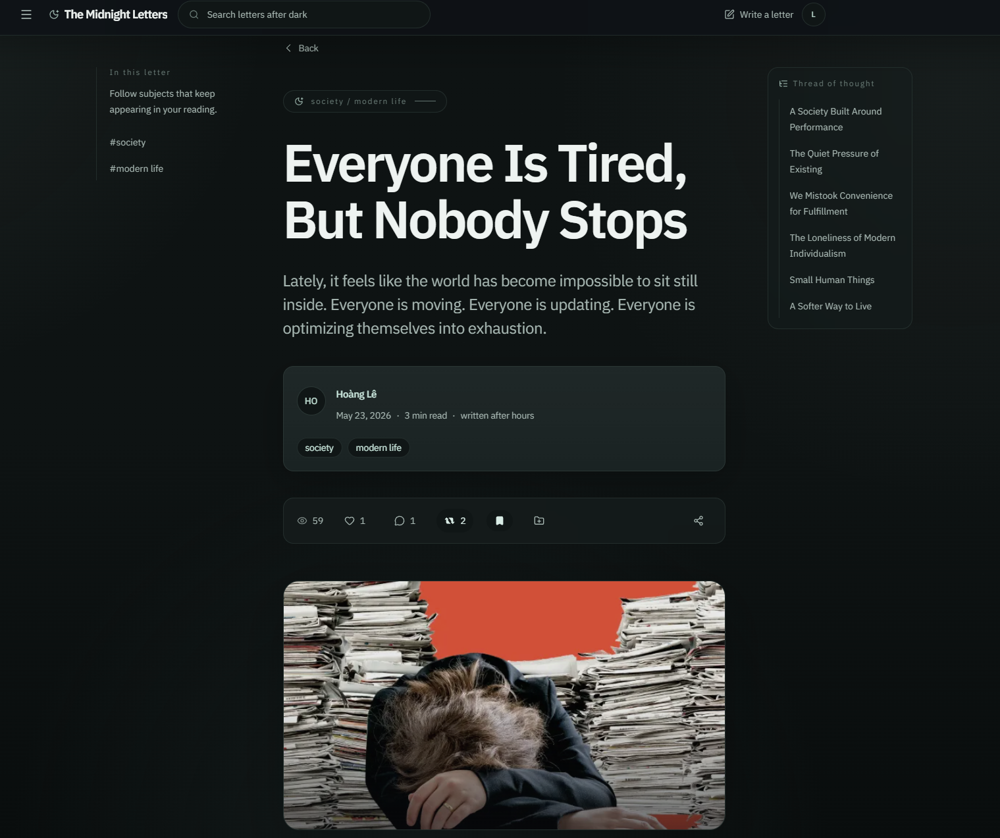

# The Midnight Letters

Website: https://themidnightletters.com

A quiet place for thoughtful writing, slow reading, and midnight reflections.

The Midnight Letters is an editorial-style writing platform built for people who still enjoy long-form thoughts in a fast-moving world. Instead of noisy feeds, endless scrolling, and algorithm-driven attention loops, the platform focuses on atmosphere, typography, calm interactions, and meaningful words.

It was created as a slower corner of the internet — a place where essays, reflections, observations, and personal thoughts can breathe. Readers can discover reflective writing, explore subjects they care about, follow writers, and quietly return to ideas that stay with them after reading.

Every detail is intentionally designed to feel immersive, minimal, and human.

It is not built to maximize attention.

It is built for people who still pause to think.

---

## Home

---

## Writing Experience

---

## Reading Experience

